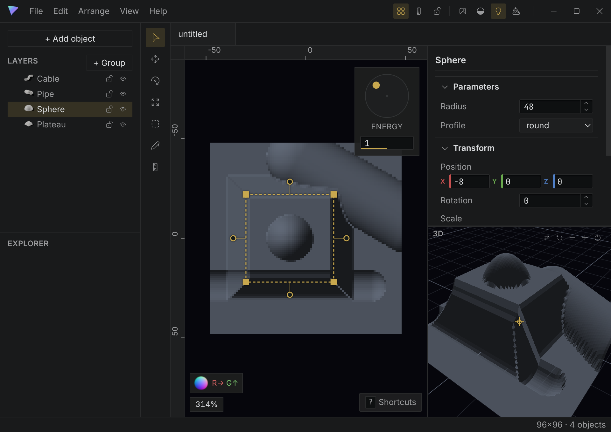

# Lambert

[](https://github.com/archwyvern/lambert/actions/workflows/ci.yml)
[](https://github.com/archwyvern/lambert/releases/latest)
[](LICENSE)

Shape-based height field authoring for normal maps. 3D but not 3D, done the hard way.

Place parametric shapes (domes, plateaus, pipes, embankments) over a reference image; Lambert
composites them into a height field on the GPU and derives a tangent-space normal map from it.
You never paint a normal color: heights are easy to author and the derived normals are correct
by construction — no seams, no hand-painted lighting errors.



**New here? Read the [artist guide](docs/guide.md)** for the workflow, and the
[shape reference](docs/shapes.md) for every object type and conversion.

## Features

- **Parametric shapes** — spheres, ramps, pipes, berms, toruses, plateaus, plates — and their
  pen-drawn Bézier twins (cables, ridges, contours, mesas, pillows), plus free triangulated
  meshes. Everything is evaluated analytically on the GPU: crisp at any zoom, live at any size.
- **Adjustment layers** — region-scoped, composable height transforms (raise/lower, multiply,
  clamp, curve, ramp) applied to everything below, each with a blend slider.
- **Emboss/Detail** — lifts surface detail out of the diffuse's own luminance (tolerance-gated
  gradient extraction integrated into height), with radius / strength / blur controls and
  Blender-style progressive preview while you scrub.
- **Four view modes** — diffuse, normal (export-gated by default), lit preview, and a coverage
  audit that flags opaque pixels no shape has touched; plus a displaced-3D inspection view.
- **Editor chrome** — command palette, rebindable shortcuts with an editor, JetBrains-style
  settings, groups with mirror symmetry, trim masks, per-object presets, drag-drop project and
  image opening, git-friendly JSON documents.
- **Exports** — engine-ready `.nx.png` normal maps (derived normals, authored-mask alpha),
  16-bit grayscale height maps, and configurable output: RGB/RGBA/RG/RGA channel layouts,
  8/16-bit depth, PNG / EXR / Radiance HDR.

## Install

Grab the Linux AppImage or the Windows installer from the
[latest release](https://github.com/archwyvern/lambert/releases/latest) (both auto-update in
place). Or run from source:

```bash
pnpm install
pnpm dev        # the editor: open/create a project, place shapes, export NX
```

A project is a folder with a `project.lambert` config; each image gets a `.lmb` document
(JSON: a source-image reference plus an ordered object list). Export produces the
`.nx.png` (tangent-space normals, authored-mask alpha) next to the document.

```bash
pnpm eval path/to/file.lmb   # headless export: writes {stem}.nx.png + debug height/normal maps
```

## Remote projects

Lambert can clone a project from any WebDAV server into a local folder and sync it back:
**Clone Remote…** on the launch screen (or File › Clone Remote Project) downloads the project's
images and documents; you work locally — offline included — then **File › Export to Remote**
uploads your `.lmb` documents and `project.lambert`, and **File › Sync from Remote** pulls new or
changed files down. The server copy is the durable one: delete the local folder and re-cloning
restores everything you exported. Servers are configured under Preferences › Remote Servers.

Sync is conflict-safe: files you haven't touched fast-forward silently, files that changed on both
sides prompt per file, uploads are compare-and-swap (`If-Match`) so two machines can't silently
overwrite each other, and nothing ever deletes a local file. Machine-local sync state lives in
`.lambert-remote.json` in the project root (never uploaded).

Any server that implements this subset works (Nextcloud and `rclone serve webdav` both qualify):

| Request | Behavior |
| --- | --- |
| `PROPFIND <base>/` (Depth 1) | 207 multistatus; child collections are the projects |
| `PROPFIND <base>/<project>/` (Depth 1) | 207; child files with `getcontentlength`, `getlastmodified`, `getetag` |
| `PROPFIND <base>/<project>/<file>` (Depth 0) | 207 for that one file |
| `GET <base>/<project>/<file>` | file bytes |
| `PUT <base>/<project>/<file>` | create/replace; honors `If-Match` and `If-None-Match: *` (412 on failure); SHOULD return `ETag` |

Auth is per-server: HTTP Basic (username + password) or a fixed API-key header you name (for
key-gated servers). Etags are treated as opaque validators — any stable content validator works.
For development, `pnpm dav:serve <dir>` serves a directory (child folders = projects) with the
reference implementation of exactly this subset, and
`electron . --capture out.png --query "davcheck=<url>&dir=<empty-dir>"` runs an end-to-end
clone/push/pull check against it through the real app.

## Development

```bash
pnpm dev        # editor with hot reload
pnpm test       # node suite (field math, packing, codegen, store, exporters, CPU goldens)
pnpm selftest   # GPU drift test vs the CPU reference (exit 0 = pass; needs a Vulkan device)
pnpm typecheck
```

The GPU fold is drift-tested against the CPU reference implementation in
`src/field/evalCpu.ts` — see `src/renderer/selftest.ts`. Tolerances live in
`src/field/compare.ts`. CI runs typecheck + tests on every push; the GPU selftest runs as a
best-effort software-Vulkan job.

Harness routes (after `electron-vite build`):
`electron . --query harness=1` (fixture normal+lit views),
`electron . --query "demo=1&mode=lit&select=ridge"` (editor with the golden fixture),
`--capture out.png` screenshots any route for automated visual checks (each run gets a fresh
profile; pass `--profile <dir>` to use a seeded one).

## Shape icons

The library palette icons are clay renders of the actual shapes, generated headlessly:

```bash
blender --background --python blender/render_icons.py   # writes src/ui/icons/*.png
```

Add a builder to `blender/render_icons.py` when a new shape type lands.

## Credits

Lambert was built for [Pigeon](https://www.instagram.com/sketchy_pigeon/) — who also designed
the logo. We love 2D style but wanted 3D lighting, so this program exists to add real lighting
to his artwork without giving up the 2D. It's open source and for everyone who wants the same.

License: MIT
